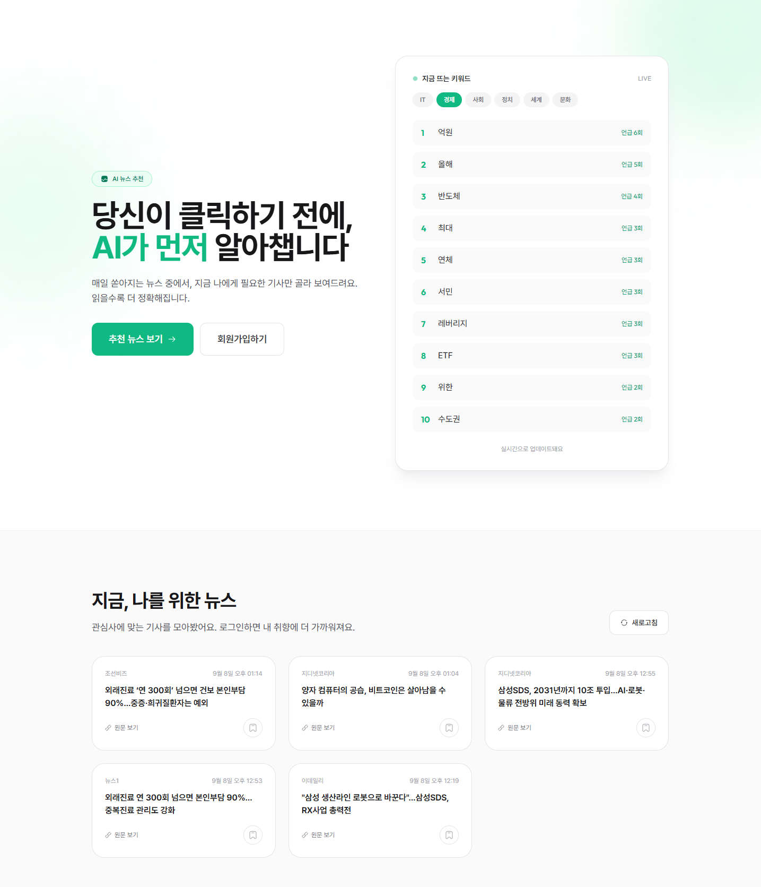
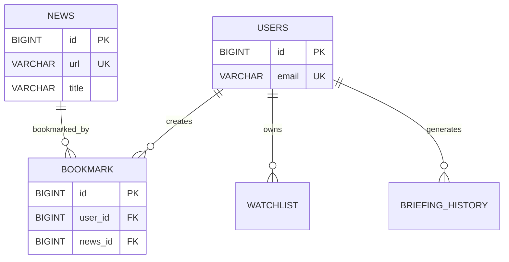

# VAP



AI 기반 뉴스 트렌드 분석 및 증시 정보 서비스

VAP는 뉴스와 금융 데이터를 한 곳에서 조회하고, 사용자 관심사와 종목 데이터를 바탕으로 개인화된 정보와 AI 분석을 제공하는 서비스입니다.

## 프로젝트 소개

VAP는 다음 두 영역으로 구성됩니다.

- **뉴스**: 뉴스 수집, 카테고리별 조회, 사용자 관심사 기반 추천, 키워드 추출 및 트렌드 분석
- **증시**: 국내·해외 지수와 종목 검색, 시세·재무·뉴스 조회, 종목 분석·비교 및 AI 브리핑

이 저장소에는 Spring Boot 백엔드와 FastAPI 기반 AI 서버가 포함되어 있습니다. 웹 프론트엔드는 별도 저장소인 `vp_front`에서 관리하며, 운영 환경에서는 Spring Boot가 정적 파일을 함께 서빙할 수 있습니다.

## 주요 기능

### 뉴스

- JWT 기반 회원가입·로그인
- 뉴스 카테고리별 조회 및 검색
- 사용자 관심사 기반 뉴스 추천
- 뉴스 북마크 및 클릭·활동 이벤트 수집
- Naver 뉴스 크롤링
- KeyBERT·SBERT 기반 키워드 추출
- Redis Sorted Set 기반 카테고리별 키워드 랭킹
- 비동기 뉴스 크롤링 작업 및 작업 상태 조회

### 증시

- 코스피, 코스닥, 코스피200, 나스닥, S&P500, 원/달러 환율 등 주요 지수 조회
- 국내·해외 종목 검색
- 종목별 시세, 차트, 재무, 기업정보 및 관련 뉴스 조회
- 관심종목 Watchlist 관리
- 2~5개 종목 비교
- 가격·거래량·재무 데이터를 이용한 종목 분석
- 관심종목 기반 AI 브리핑
- 금융 데이터 Provider 장애 시 대체 Provider 사용
- Redis 기반 캐시와 요청 제한

## 데이터 모델



대표 ERD는 아래 문서에서 확인할 수 있습니다.

- [ERD 상세 문서](docs/ERD.md)

## 기술 스택

### Backend

- Java 17
- Spring Boot 3.2.5
- Spring Web
- Spring Data JPA / Hibernate
- Spring Security
- JWT (`jjwt`)
- Spring Kafka

### AI Server

- Python
- FastAPI
- Uvicorn
- OpenBB
- yfinance
- OpenAI API
- KeyBERT
- Sentence-BERT
- KoNLPy / Okt
- Requests / BeautifulSoup / Selenium

### Data and Messaging

- MySQL 8.0
- Redis 7
- Apache Kafka 7.5, KRaft mode

### Infrastructure

- Docker Compose
- GitHub Actions
- Prometheus
- Grafana

## 프로젝트 구조

```text
vp_bank/
├── backend/                 # Spring Boot API 서버
│   └── src/main/java/        # Controller, Service, Repository, Kafka
├── ai/                       # FastAPI AI·크롤링·금융 데이터 서버
│   ├── analysis/             # 종목 분석, 비교, 브리핑, LLM
│   ├── market/               # OpenBB·yfinance 시장 데이터
│   └── crawler/              # 뉴스 크롤러
├── infra/                    # Docker Compose 및 운영 설정
├── docs/                     # 아키텍처 및 실험 문서
└── README.md
```

## 실행 환경

### 사전 요구사항

- Java 17 이상
- Python 3.10 이상
- Docker 및 Docker Compose
- OpenAI API Key (AI 서술 기능 사용 시)

### 1. 인프라 실행

```bash
cd infra
docker compose up -d mysql redis kafka
```

### 2. AI 서버 실행

```bash
cd ai
python -m venv .venv

# macOS / Linux
source .venv/bin/activate

# Windows PowerShell
.venv\\Scripts\\Activate.ps1

pip install -r requirements.txt
uvicorn main:app --host 0.0.0.0 --port 8000
```

`ai/.env`를 생성하고 필요한 경우 다음 값을 설정합니다.

```env
OPENAI_API_KEY=your-api-key
REDIS_HOST=127.0.0.1
SPRING_HOST=127.0.0.1
```

### 3. Backend 실행

```bash
cd backend
./gradlew bootRun
```

Windows에서는 다음 명령을 사용할 수 있습니다.

```powershell
.\\gradlew.bat bootRun
```

기본 포트는 다음과 같습니다.

| 서비스 | 포트 |
|---|---:|
| Spring Boot | 8080 |
| FastAPI | 8000 |
| MySQL | 3307 |
| Redis | 6379 |
| Kafka | 9094 / 29093 |

## 테스트

Backend 테스트:

```bash
cd backend
./gradlew test
```

AI 테스트:

```bash
cd ai
pytest
```

## API 문서

Spring Boot 실행 후 Swagger UI에서 REST API를 확인할 수 있습니다.

```text
http://localhost:8080/swagger-ui/index.html
```

FastAPI 실행 후에는 다음 주소에서 OpenAPI 문서를 확인할 수 있습니다.

```text
http://localhost:8000/docs
```

## 운영 및 관측성

운영용 Docker Compose 설정은 `infra/compose-prod.yaml`에 있습니다. Backend에는 Prometheus와 Grafana 설정이 포함되어 있으며, 주요 요청 처리 시간과 애플리케이션 상태를 관측할 수 있습니다.

장기 작업이나 다중 서버 배포 환경에서는 다음 보완이 필요합니다.

- 크롤링 작업 이력을 Redis가 아닌 영속 DB에 저장
- 내부 API를 관리자 또는 서비스 간 인증으로 제한
- 다중 서버 환경의 SSE emitter를 Redis Pub/Sub 또는 별도 알림 게이트웨이로 분리
- Kafka 메시지 재처리 및 Dead Letter Topic 운영

## 관련 문서

- [ERD 상세 문서](docs/ERD.md)
- [비동기 크롤링 결과 통지 구조](docs/ASYNC_NOTIFICATION_ARCHITECTURE.md)
- [금융 AI 개발 계획](docs/FINANCIAL_AI_DEVELOPMENT_PLAN.md)
- [키워드 실험 보고서](docs/keyword-experiment-report.md)
- [Kubernetes 인프라 계획](docs/k8s-infra-plan.md)
