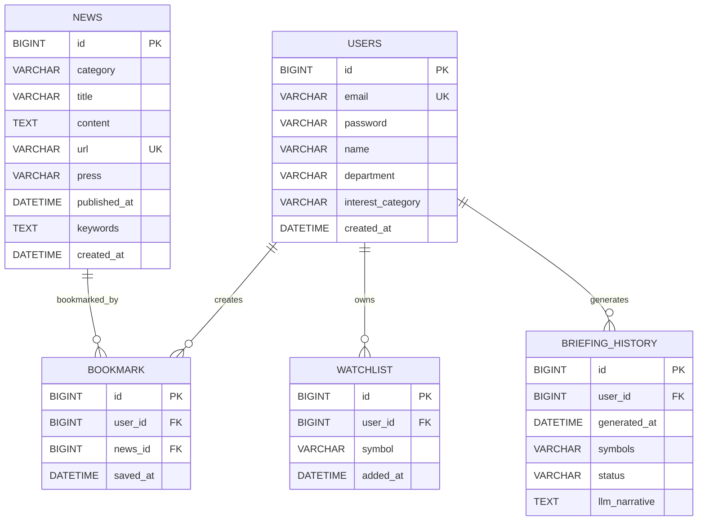

# VAP 데이터 모델(ERD)

## 대표 ERD



## 테이블 정의

| 테이블 | 역할 | 주요 컬럼 |
|---|---|---|
| `users` | 사용자 및 인증 정보 | `id`, `email`, `interest_category` |
| `news` | 크롤링 뉴스와 키워드 분석 결과 | `id`, `url`, `category`, `published_at`, `keywords` |
| `bookmark` | 사용자와 뉴스의 저장 관계 | `user_id`, `news_id`, `saved_at` |
| `watchlist` | 사용자의 관심종목 | `user_id`, `symbol`, `added_at` |
| `briefing_history` | AI 브리핑 생성 이력 | `user_id`, `symbols`, `generated_at`, `llm_narrative` |

## 관계 및 무결성 제약

```text
bookmark.user_id          → users.id
bookmark.news_id          → news.id
watchlist.user_id         → users.id
briefing_history.user_id  → users.id
```

| 테이블 | 제약조건 | 목적 |
|---|---|---|
| `users` | `email UNIQUE` | 사용자 계정 중복 방지 |
| `news` | `url UNIQUE` | 동일 뉴스 중복 저장 방지 |
| `bookmark` | `UNIQUE(user_id, news_id)` | 동일 사용자의 중복 북마크 방지 |
| `watchlist` | `UNIQUE(user_id, symbol)` | 동일 사용자의 중복 관심종목 방지 |

## 인덱스

| 테이블 | 인덱스 | 사용 목적 |
|---|---|---|
| `news` | `idx_category(category)` | 카테고리별 뉴스 조회 |
| `news` | `idx_published_at(published_at)` | 최신 뉴스 정렬 및 조회 |
| `briefing_history` | `idx_briefing_user(user_id, generated_at)` | 사용자별 최근 브리핑 조회 |
| `bookmark` | `uk_bookmark_user_news(user_id, news_id)` | 중복 방지 및 사용자별 북마크 식별 |
| `watchlist` | `uk_watchlist_user_symbol(user_id, symbol)` | 중복 방지 및 사용자별 관심종목 식별 |

## 저장소별 데이터 경계

관계형 데이터베이스에 저장되는 데이터와 캐시·메시징 데이터는 다음과 같이 분리됩니다.

```text
MySQL
 ├─ users
 ├─ news
 ├─ bookmark
 ├─ watchlist
 └─ briefing_history

Redis
 ├─ 뉴스 캐시
 ├─ 카테고리별 키워드 랭킹
 ├─ 사용자 관심 키워드
 ├─ Rate Limit 상태
 └─ 비동기 크롤링 Job 상태

Kafka
 ├─ crawl-news
 ├─ users-topic
 └─ news-alert

External Provider
 └─ OpenBB / yfinance 시세·재무 데이터
```

종목 시세·재무 데이터는 외부 Provider에서 조회하므로 현재 MySQL의 관계형 ERD에는 종목 원천 데이터 테이블이 포함되지 않습니다.

## 주요 데이터 흐름

### 북마크 저장

```text
Client: 뉴스 URL 전송
  → NewsRepository.findByUrl(url)
  → NEWS.id 조회
  → BOOKMARK.news_id 저장
```

클라이언트 API는 기존 호환성을 위해 URL을 입력으로 받지만, 데이터베이스에는 뉴스 URL을 중복 저장하지 않고 `news_id`를 저장합니다.

### 북마크 조회

```text
BOOKMARK
  → BOOKMARK.news_id로 NEWS 조회
  → 뉴스 URL·제목·언론사·발행일 반환
```

### 뉴스 수집

```text
FastAPI Crawler
  → Spring Boot 내부 뉴스 API
  → NEWS 저장
  → Redis 뉴스 캐시 및 키워드 랭킹 갱신
```
