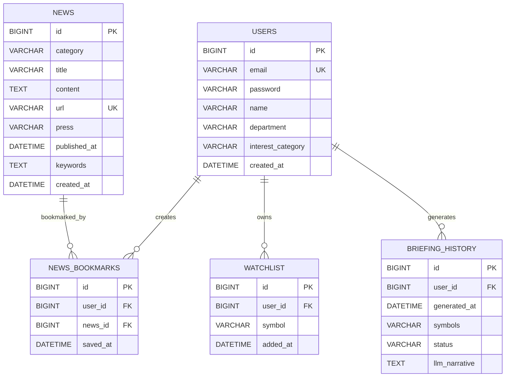

# VAP 데이터 모델(ERD)

## 대표 ERD



## 테이블 설명

### `users`

서비스 사용자와 인증 정보를 저장합니다. 이메일은 중복될 수 없으며, 뉴스 관심 카테고리와 개인 정보를 함께 관리합니다.

### `news`

크롤링된 뉴스의 원문과 분석 결과를 저장합니다. `url`은 동일 뉴스의 중복 저장을 막기 위해 unique로 관리하며, 카테고리와 발행 시각에 인덱스를 둡니다.

### `bookmark`

사용자가 저장한 뉴스를 표현하는 연결 테이블입니다.

- `user_id` → `users.id`
- `news_id` → `news.id`
- `(user_id, news_id)` unique로 동일 사용자의 중복 북마크 방지
- 뉴스 제목이나 URL을 복사하지 않고 `news_id`로 원본 뉴스 조회

클라이언트 요청은 기존 호환성을 위해 뉴스 URL을 받을 수 있지만, 백엔드에서는 URL로 `news`를 조회한 뒤 `news_id`를 저장합니다.

### `watchlist`

사용자가 관심 등록한 종목 코드를 저장합니다. 현재 시세·재무 정보는 외부 Provider에서 실시간 조회하므로 별도의 `stock` 테이블은 사용하지 않습니다.

### `briefing_history`

사용자별 AI 브리핑 생성 이력과 생성 결과를 저장합니다. `symbols`는 현재 관심종목 코드를 콤마로 저장하는 구조입니다.

## 무결성 규칙

현재 스키마에는 다음 foreign key가 적용되어 있습니다.

```text
bookmark.user_id          → users.id
bookmark.news_id          → news.id
watchlist.user_id         → users.id
briefing_history.user_id  → users.id
```

뉴스 또는 사용자를 삭제할 때 연결된 북마크·관심종목·브리핑 이력을 어떻게 처리할지는 운영 정책에 따라 결정해야 합니다. 뉴스는 북마크 이력 보존을 위해 실제 삭제보다 `deleted_at`을 사용하는 Soft Delete 방식을 권장합니다.

## 기존 데이터 마이그레이션

기존 `bookmark`가 `news_url`을 사용하고 있었다면 다음 순서로 마이그레이션할 수 있습니다.

```sql
ALTER TABLE bookmark ADD COLUMN news_id BIGINT NULL;

UPDATE bookmark b
JOIN news n ON n.url = b.news_url
SET b.news_id = n.id;

-- 매칭되지 않은 북마크를 확인한 뒤 별도 처리
SELECT * FROM bookmark WHERE news_id IS NULL;

ALTER TABLE bookmark
    MODIFY news_id BIGINT NOT NULL,
    ADD CONSTRAINT fk_bookmark_news
        FOREIGN KEY (news_id) REFERENCES news(id),
    ADD CONSTRAINT uk_bookmark_user_news
        UNIQUE (user_id, news_id);

ALTER TABLE bookmark
    DROP COLUMN news_url,
    DROP COLUMN title,
    DROP COLUMN press,
    DROP COLUMN published_at;
```

실제 운영 DB에 적용할 때는 애플리케이션 중단 여부와 매칭되지 않은 북마크 처리 정책을 먼저 확인해야 합니다.
